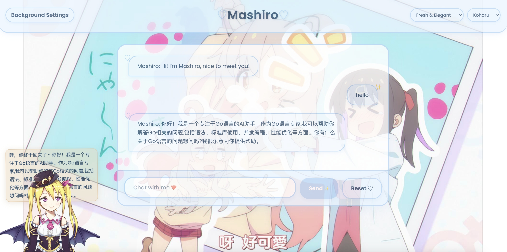
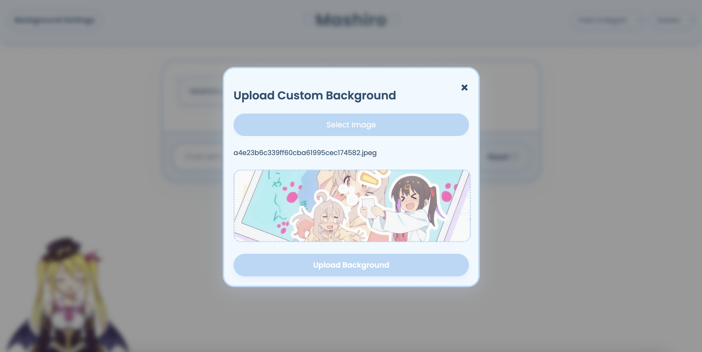
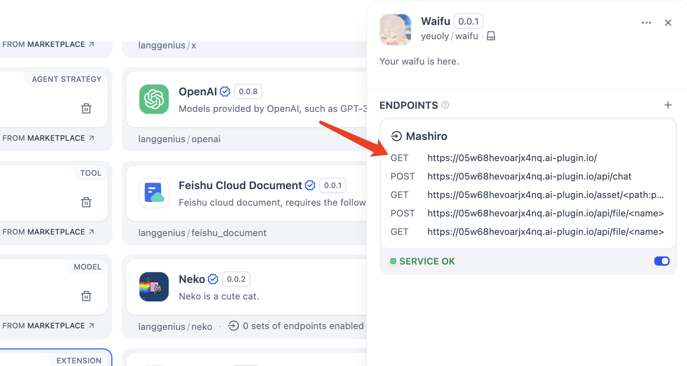

# Waifu

Author: [@Yeuoly](https://github.com/Yeuoly)

Waifu is a Dify plugin that allows you to chat with a kawaii style webapp.

## Overview

You can setup your own waifu by uploading a custom avatar and background also.

## Usage

Install the plugin 

Then setup this plugin in the `Plugin` page.

Finally, click here to start chatting with your waifu.

